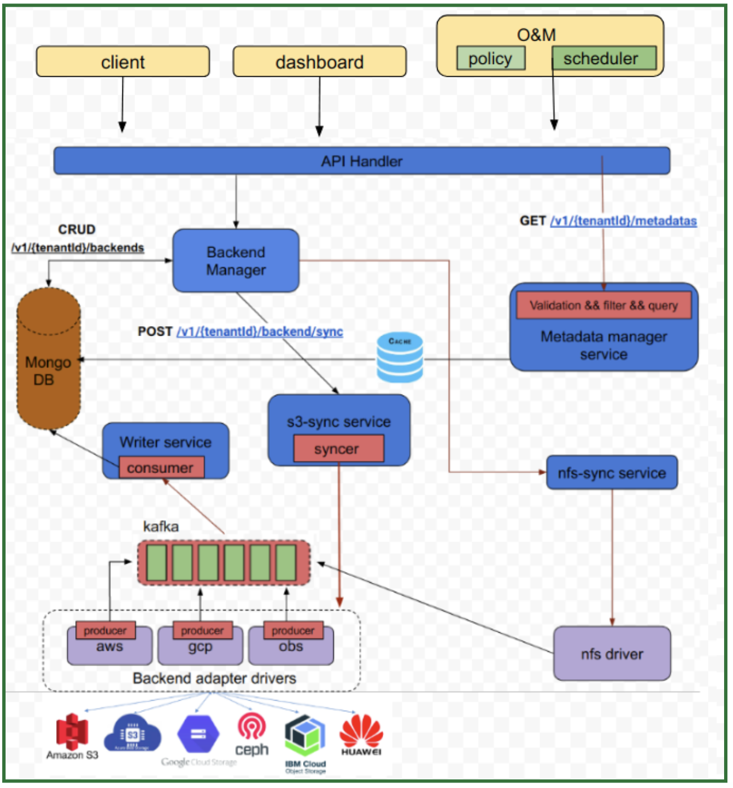
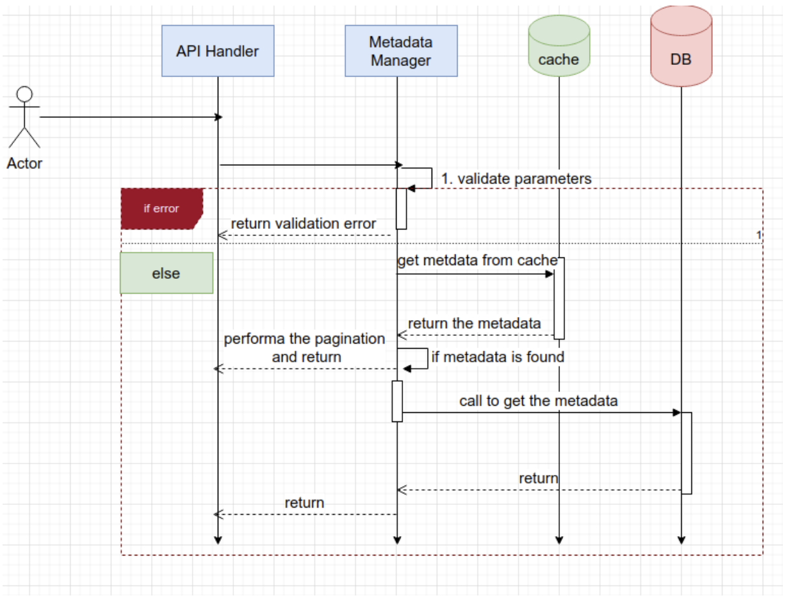

# Metadata Management (Crystal)

**Author(s)**: [Pravin Ranjan](https://github.com/PravinRanjan10)

## Motivation and background

Metadata gives basic information about data—including type, time of creation, size of object/buckets, storage class, user-defined fields, and more for cloud object storages. Metadata management is the business discipline of managing the metadata about data. It can play key roles during decision making activity. Thus metadata management is required nowadays.

A user may provision s3 supported buckets using some solution like strato(multi-cloud project from SODAFOUNDATION) and/or manually. To get and manage metadata of all buckets/objects provisioned by manually and automatically, another solution required. Because, there would be no metadata available for manually provisioned buckets.

### Goals
Develop a Metadata Management Service which can discover, harvest, and manage all Externally orchestrated S3 supported buckets and its corresponding metadata from one place. It should perform following operations:
Access the Metadata
Acquire the Metadata
Store the Metadata
And, Process the Metadata(search, classify, optimize etc.)

### Non-Goals
The ability to manage nfs, smb etc will be handled in future
Unification of metadata interfaces will be handled in future
Data mover functionality is out of scope of this analysis and design
API gateway integration will be handled in future

### Functional Requirements
* **Discovery and Extraction**: Automate metadata harvesting of externally orchestrated S3 buckets from multiple Cloud vendors. This can be done as:
  * Manual Sync
  * Scheduled/policy based Sync
  * Auto sync(event-driven)

* **Metadata Store**: A single metadata store for all S3 supported buckets and objects metadata

* **Filter and Search**: Search metadata across the entire data catalog. Filter metadata based on various parameters like, tags, type, size, region, etc.
* **Classification**: Classification of metadata based on some user configuration.

* Download the objects

* List/Get/search access for user and admin should be handled properly

### Non Functional Requirements

* The service should be available all the time

* The service should be easily scalable

* Result of Search and Filtration should be fast

## Design Details

Below is description of each component:

**a) API Handler**:
This module expose REST API’s to client

**b) Metadata Manager**:

This is independent microservice, which has three tasks:

  1)  Validation: validations of requests, data type, length etc

  2)  Filter: based on request, filter the metadata

  3)  Query: prepare query structure and get the metadata from db

**c) Storage adapter**:

It contains all drivers of respective cloud providers.

**d) Writer service**:

It is responsible for writing data which is coming from kafka topic 

**d) Backend manager**

Fig.1: High level architecture diagram

### Sequence Diagram:

**Get metadata**:

## API SPEC:

### [POST /v1/{tenantId}/backends/sync]()

Collect the metadata for all backends

**Request Body:**

None

**Response Body:**

	{
        errorCode: int
	       msg: string // “sync request sent successfully!”
    }

### [POST /v1/{tenantId}/backends/{backendId}/sync]()
Collect the metadata for particular backend

**Request Parameters:**

     *backendId: string

**Request Body:**

None

**Response Body:**

	{
      errorCode: int
      msg: string // “sync request sent successfully!”
    }

### [GET /v1/{tenantId}/metadatas]()

List all the metadata for all backends

**Request Parameters:**

limit  int

Offset int

Type string

backendName string

Region string

bucketName string

objectName string

sizeOfObject int

sizeOfBucket int

bucketSizeOperator string

**Request Body:**

  NA

**Response Body:**

    {
    "buckets": [

      {
        "id": "084bf71e-a102-11e7-88a8-e31fe6d52248",
        "creationDate: "2022-11-10T14:36:58.014Z",
        "name": "string",  // bucket-01
        "region": "string",  // ap-south-1
        "type": "string"  // aws
        "access": "string"  // Objects can be public
        "numberOfObjects": integer // 50
        "totalSize(in bytes)": integer  // 100
        "tags": {key1: value1}
        "objects": [
            {
  	      "id": "084bf71e-a102-11e7-88a8-e31fe6d52248",
  	      "lastModifiedDate: "2022-11-10T14:36:58.014Z",
  	      "name": string,
  	      "bucketName": string
  	      "size": bytes
  	      "type": string
  	      "serverSideEncryptionEnabled": bool
  	      "versionId": integer
  	      "storageClass": string
  	      "redirectLocation": string
  	      "replicationStatus": string
  	      "expiresDate": string
  	      "grantControl": string
  	      "tags": {string:string}
  	      "metadata": {string:string
           },
         ]
      },
      ]
    }
